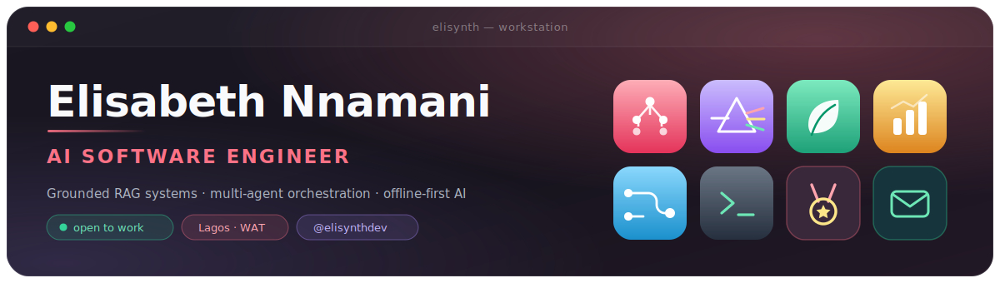
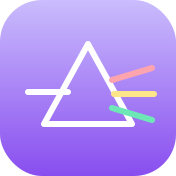
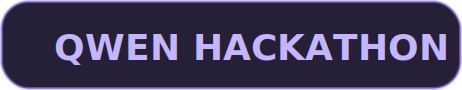
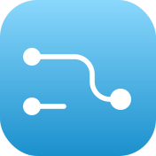
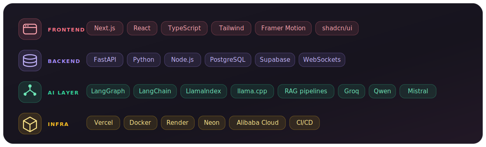

## 🛠️ &nbsp;What's running

<table>
<tr>
<td width="64" align="center"></td>
<td>
<b><a href="https://atlas-ai-taupe.vercel.app">Atlas AI</a></b>&nbsp;&nbsp;&nbsp; 
Plain-English request → production data artifacts: dbt models, SQL, tests, docs. Six sequential agents grounded in a real DataHub catalog, with two human approval gates that are genuine orchestrator pauses — they survive a restart. 
<code>FastAPI</code> <code>async SQLAlchemy</code> <code>WebSockets</code> <code>Groq</code> <code>DataHub</code> <code>Next.js</code>
</td>
</tr>
<tr>
<td align="center"></td>
<td>
<b><a href="https://prism-os-jade.vercel.app">PrismOS</a></b>&nbsp;&nbsp;&nbsp; 
Point it at a codebase, describe a feature, get the code <i>and</i> the argument that produced it. Seven agents required to disagree, every conflict written to a log, QA holding a binding ship/revise verdict. 
<code>LangGraph</code> <code>FastAPI</code> <code>Qwen3-235B</code> <code>Next.js 14</code> <code>Supabase</code> <code>Alibaba Cloud</code>
</td>
</tr>
<tr>
<td align="center"></td>
<td>
<b><a href="https://github.com/Elisabeth56/FarmTwin">FarmTwin</a></b>&nbsp;&nbsp;&nbsp; 
Agronomic advisor for a Nigerian smallholder maize farm. Model, vector index and knowledge base all on-device — zero network calls at runtime, on a 2014 MacBook with 8&nbsp;GB of RAM. Every answer cited back to NAERLS, IITA, CIMMYT or FAO. 
<code>llama.cpp</code> <code>Qwen2.5-3B Q4_K_M</code> <code>sqlite-vec</code> <code>FastAPI</code> <code>React</code>
</td>
</tr>
<tr>
<td align="center"></td>
<td>
<b><a href="https://finsight-red-two.vercel.app">FinSight AI</b>&nbsp;&nbsp; 
Personal finance dashboard with RAG chat over your own transactions. 
<code>Next.js</code> <code>FastAPI</code> <code>LlamaIndex</code> <code>LLaMA 3</code> <code>PostgreSQL</code>
</td>
</tr>
<tr>
<td align="center"></td>
<td>
<b><a href="https://flowmind-sage.vercel.app">FlowMind</b>&nbsp;&nbsp; 
Workflow automation OS — the repetitive parts of a work week, delegated. 
<code>Next.js</code> <code>Supabase</code> <code>LangChain</code> <code>Mistral</code> <code>shadcn/ui</code>
</td>
</tr>
</table>

## 🧭 &nbsp;Three decisions I'd defend

> [!IMPORTANT]
> **Grounding beats generation.**
> Atlas exists because an LLM asked for SQL will confidently invent a schema. Anchoring it to the organisation's real catalog is the whole difference between a demo and something a data team would run in production.

> [!NOTE]
> **A benchmark you grade yourself is worthless if you grade it kindly.**
> I scored FarmTwin at ~98.8, re-read the rubric properly, and re-graded it down to 87.6. The second number is the one in the repo.

> [!TIP]
> **Cut the feature you want most if it fails the gate.**
> Pidgin voice input was the thing I most wanted in FarmTwin — I'm a native speaker. I set a 40% WER threshold *before* testing, both candidate models missed it, the feature shipped English-only, and the reasoning went into ADR-011.

## 🧰 &nbsp;Stack

## 🌍 &nbsp;Also true

- 🏁 &nbsp;I run through hackathons — **Qwen Cloud** (Agent Society), **Africa Deep Tech Challenge**, because a hard deadline is the fastest way to find out whether an architecture actually holds.
- 🧪 &nbsp;Freelance: AI apps, automations, SaaS MVPs, dashboards, internal tools.
- 📌 &nbsp;I keep the caveats public. Every repo README says what isn't verified yet.

  <a href="https://elisabethnnamani.dev">Portfolio</a> ·
  <a href="https://linkedin.com/in/elisabethnnamani">LinkedIn</a> ·
  <a href="https://x.com/elisynthdev">X</a> ·
  <a href="mailto:hello@elisabethnnamani.dev">Email</a>

